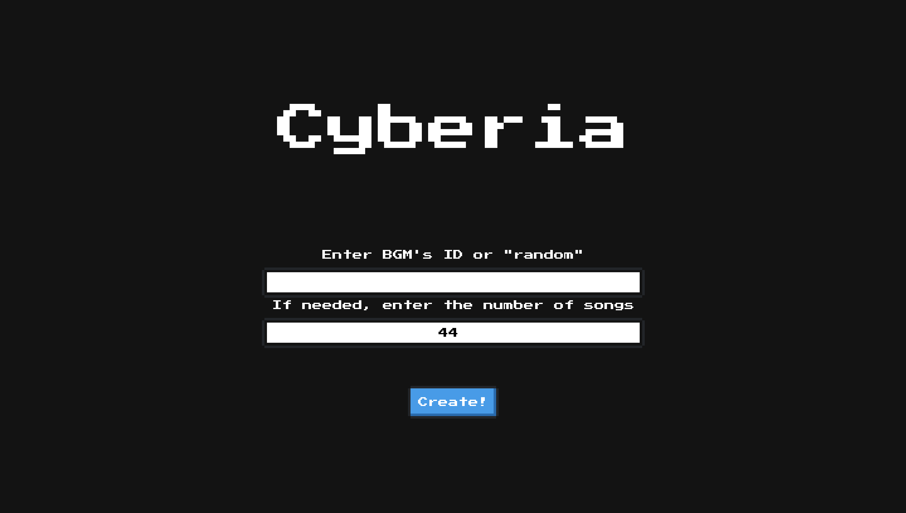

# Cyberia



## Overview
Cyberia helps users look for new game BGMs in Spotify. Specifically, the application creates two types of playlists that contain only game BGMs.

- A Playlist containing BGMs that have close features to user-chosen BGM.
- A Playlist containing randomly chosen BGMs.

## Getting Started
### 0. Preparation
- Get `Client ID`, `Client Secret` from Spotify for Developers.
    - You also need to set `Redirect URIs` in `EDIT SETTINGS`.
- Execute the command line below.

```
$ export SPOTIFY_CLIENT_ID="{Client ID}"
$ export SPOTIFY_CLIENT_SECRET="{Client Secret}"
$ export SPOTIFY_USERNAME="{Your username in Spotify}"
$ export SPOTIFY_REDIRECT_URL="{Redirect URL}"
```

### 1. Docker image preparation
- Build docker images via

```
$ bash build.sh
```

### 2. Start Cyberia
- Start application via the command below and access `0.0.0.0:5001`.

```
$ docker-compose up -d
```

## User Guide
### 0. Fill in textboxes
You need to fill in two textboxes (One is not always needed because default number is already set) in advance.

- First textbox: ID of each track or "random"
  - ID is included in Spotify's URL of each track.
- Second textbox: Number of BGMs in playlist.
  - default number is 44. You cannot set the number greater than 10000.

### 1. Push the button
After filling in textboxes, you need to `Create!` button.

### 2. Results
- If you enter ID of your chosen song, Cyberia redirects to the page of playlist named `{Name of your chosen song}RelatedSongs`.
- If you enter "random", Cyberia redirects to the page of playlist named `RandomlyChosenSongs`.